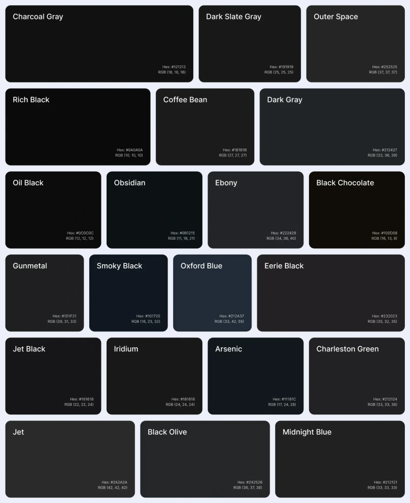

# Alternativas para a Cor Preto Puro

Aqui está sua tabela adaptada para o formato desejado:

## Documentação de cores

| Cor               | Hexadecimal                                                      |
| ----------------- | ---------------------------------------------------------------- |
| Charcoal Gray     |  #121212 |
| Dark Slate Gray   |  #191919 |
| Outer Space       |  #252525 |
| Rich Black        |  #0A0A0A |
| Coffee Bean       |  #1B1B1B |
| Dark Gray         |  #212427 |
| Oil Black         |  #0C0C0C |
| Obsidian          |  #0B1215 |
| Ebony             |  #222428 |
| Black Chocolate   |  #100D08 |
| Gunmetal          |  #1D1F21 |
| Smoky Black       |  #101720 |
| Oxford Blue       |  #212A37 |
| Eerie Black       |  #232023 |
| Jet Black         |  #161618 |
| Iridium           |  #181818 |
| Arsenic           |  #11181C |
| Charleston Green  |  #212124 |
| Dark Gunmetal     |  #222428 |
| Jet               |  #2A2A2A |
| Black Olive       |  #242526 |
| Midnight Blue     |  #212121 |