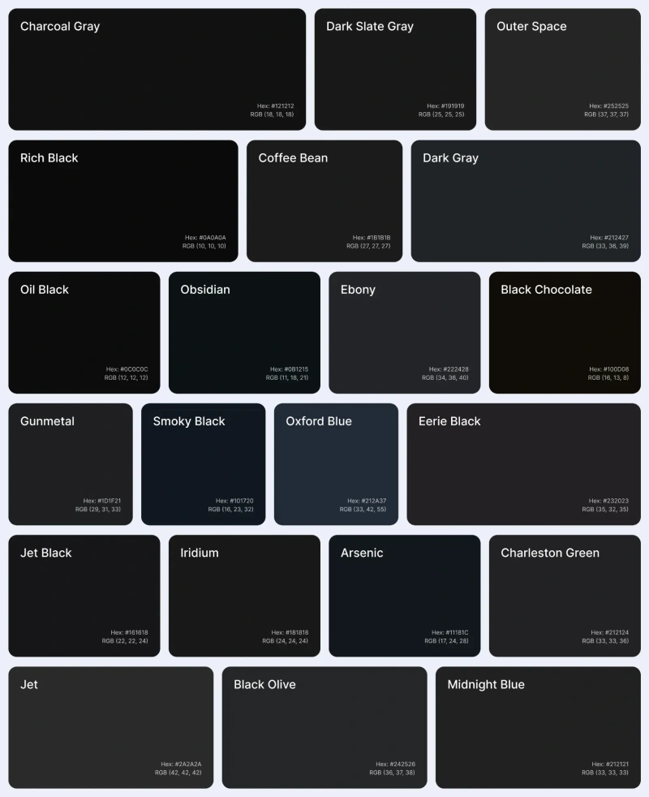

# Alternativas para a Cor Preto Puro

| Color Name        | Hex Code |
|-------------------|----------|
| Charcoal Gray     | #121212  |
| Dark Slate Gray   | #191919  |
| Outer Space       | #252525  |
| Rich Black        | #0A0A0A  |
| Coffee Bean       | #1B1B1B  |
| Dark Gray         | #212427  |
| Oil Black         | #0C0C0C  |
| Obsidian          | #0B1215  |
| Ebony             | #222428  |
| Black Chocolate   | #100D08  |
| Gunmetal          | #1D1F21  |
| Smoky Black       | #101720  |
| Oxford Blue       | #212A37  |
| Eerie Black       | #232023  |
| Jet Black         | #161618  |
| Iridium           | #181818  |
| Arsenic           | #11181C  |
| Charleston Green  | #212124  |
| Dark Gunmetal     | #222428  |
| Jet               | #2A2A2A  |
| Black Olive       | #242526  |
| Midnight Blue     | #212121  |
